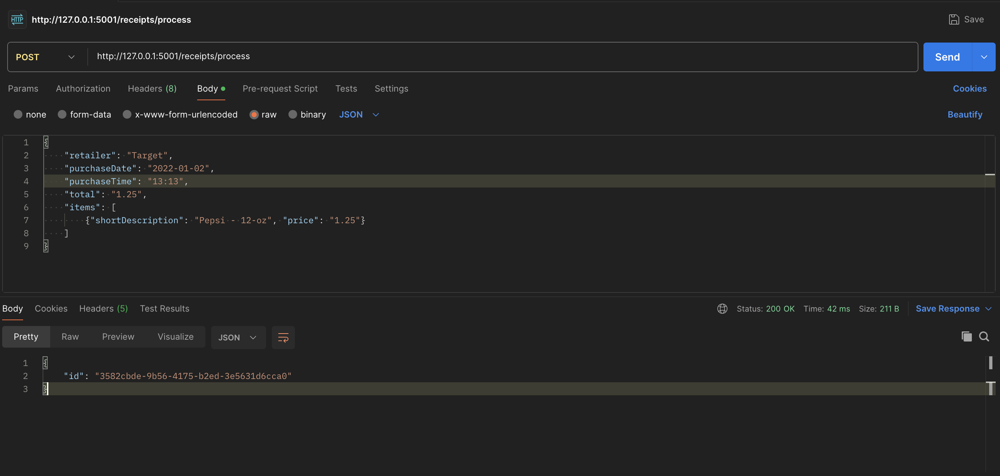
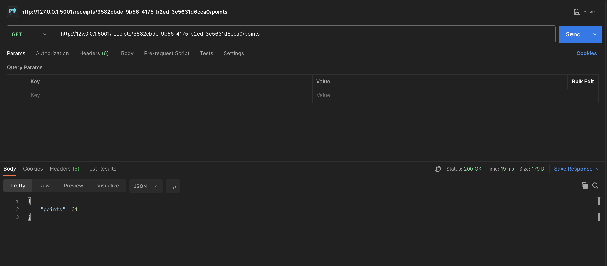
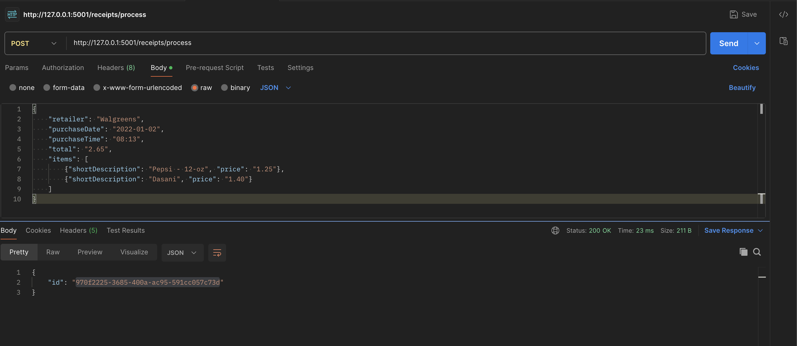
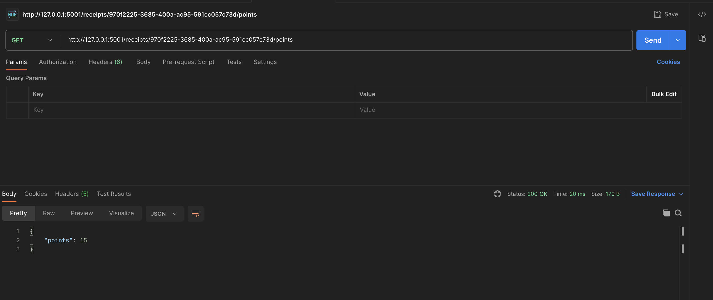
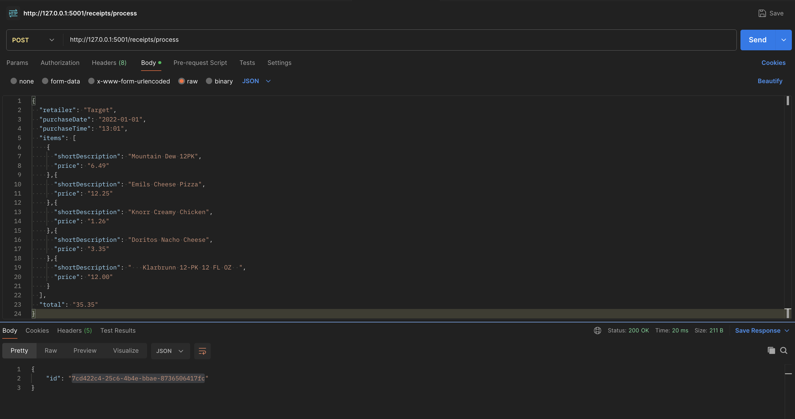
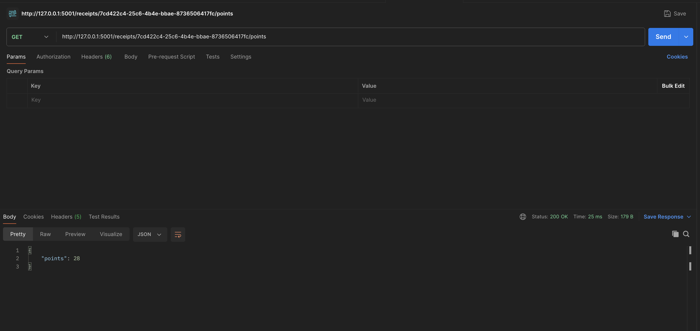
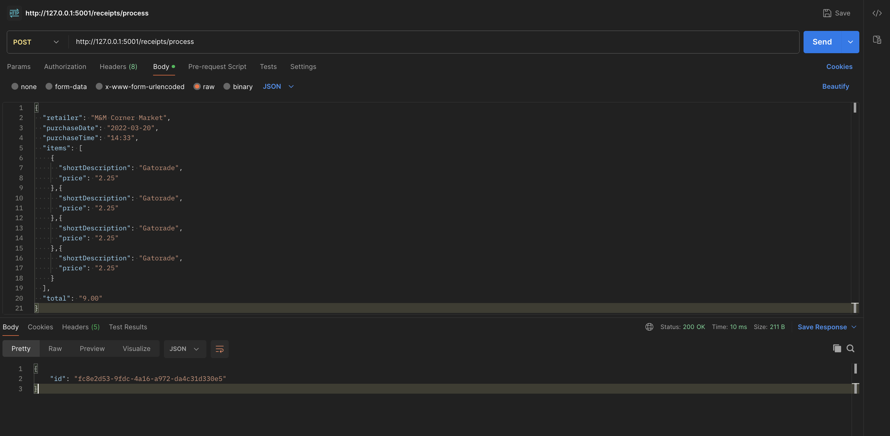
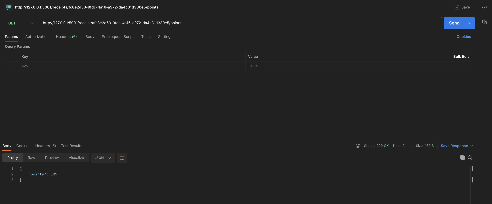

# Receipt Processor API

## Overview

This is a Flask-based web service that processes receipts and calculates points based on specific rules. The API allows users to submit receipts and retrieve the awarded points.

## Features

- Submit a receipt for processing
- Retrieve points awarded for a receipt
- Stateless in-memory storage for receipts

## Validation Rules

- **Retailer Name**: Must be alphanumeric, spaces, `-`, or `&`.
- **Purchase Date**: Must follow `YYYY-MM-DD` format.
- **Purchase Time**: Must follow `HH:MM` format.
- **Total Amount**: Must be a decimal with two places (e.g., `1.25`).
- **Items**: Must be a non-empty list.
- **Short Description**: Must be alphanumeric, spaces, or `-`.
- **Item Price**: Must be a decimal with two places (e.g., `2.49`).

## Installation

### Prerequisites

- Python 3.9+
- Docker (for containerized deployment)

### Steps

## Clone the repository:

```sh
git clone https://github.com/Davleen14/receipt_process.git
cd receipt_processor
```
## Running with Docker

### Build the Docker Image

```sh
docker build -t receipt-processor .
```

### Run the Docker Container

```sh
docker run -p 5001:5000 receipt-processor
```

Now access the API at `http://127.0.0.1:5001`.

## API Endpoints

### 1. Process a Receipt

**Endpoint:** `POST /receipts/process`

**Request Body:**

```json
{
  "retailer": "Target",
  "purchaseDate": "2022-01-02",
  "purchaseTime": "13:13",
  "total": "1.25",
  "items": [{ "shortDescription": "Pepsi - 12-oz", "price": "1.25" }]
}
```

**Response:**

```json
{ "id": "generated-receipt-id" }
```

### 2. Retrieve Points

**Endpoint:** `GET /receipts/{id}/points`

**Response:**

```json
{ "points": 31 }
```

## Testing with Postman

1. Example-1
   
   

2. Example-2
   
   

3. Example-3
   
   
4. Example-4
   
   
